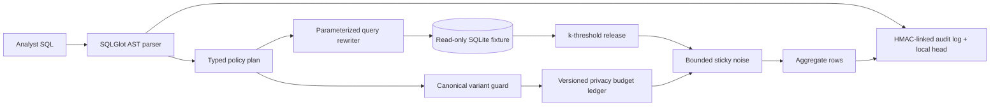

# Secure Data Clean Room

**Policy-enforced aggregate analytics over a sensitive dataset, without raw-row access.**

[](https://github.com/Vincent-P-essy/secure-data-clean-room/actions/workflows/ci.yml)
[](pyproject.toml)
[](LICENSE)

Secure Data Clean Room accepts a deliberately narrow SQL subset and turns it
into an auditable query plan. It parses the request as an AST, rejects unsafe
shapes, extracts only approved dimensions, aggregates, and filters, then builds
a new parameterized statement itself. The submitted SQL is never sent directly
to SQLite.

This is a reproducible security demonstrator over synthetic workforce data. It
is not a certified differential-privacy product, a general SQL gateway, or a
substitute for legal and data-governance review.

## Security properties demonstrated

- `SELECT`-only AST validation; joins, subqueries, unions, CTEs, user-controlled
  `HAVING`, wildcard projection, and arbitrary functions are outside the query subset.
- Column-level policy: direct identifiers and raw sensitive metrics cannot be selected
  or filtered by an analyst.
- Query recompilation from a typed allowlisted plan with bound SQLite parameters.
- Mandatory `k=10` group threshold enforced by the trusted rewriter and checked again
  before release.
- Bounded Laplace noise for `COUNT(*)` and approved averages, with a per-principal
  epsilon ledger. Dataset version, filter semantics, dimensions and metric identity form
  the release key; presentation-only alias and order changes reuse the same sticky noise.
- A 24-hour query-variant guard that canonicalizes safe equivalences before limiting
  systematic slicing of the same aggregate.
- Pseudonymous subject tokens generated with HMAC; the demo database never stores names.
- Read-only immutable SQLite connections, an authorizer callback, VM-step limit, query
  timeout, and result-row cap as defense in depth.
- Separate analyst, privacy-officer, and auditor roles.
- An HMAC-linked audit chain plus an authenticated local head/count checkpoint, updated in
  the same transaction, that stores query hashes and decisions rather than SQL.

## Architecture



The control path is deterministic except for secret-derived privacy noise. The
demo keys are fixed only to make local evidence reproducible; production-like
runs must inject independent secrets.

## Quick start

Requirements: Python 3.12 and `uv`.

```bash
export CLEAN_ROOM_DEMO_MODE=1
uv sync --frozen --all-extras
uv run clean-room init-demo
uv run clean-room query --sql \
  'SELECT department, AVG(salary) AS avg_salary FROM employees GROUP BY department'
uv run clean-room verify-audit
```

The direct-row request from the project brief is refused:

```bash
uv run clean-room query --sql \
  "SELECT salary FROM employees WHERE name = 'Alice'"
```

Start the local API and dashboard:

```bash
uv run clean-room serve --host 127.0.0.1 --port 8080
```

Open <http://127.0.0.1:8080> and use the explicitly non-production key
`demo-analyst-key`. The API schema is available at `/docs`.

## Supported analyst SQL

The accepted grammar is intentionally small:

```sql
SELECT <approved dimensions>,
       AVG(<bounded metric>) [AS alias],
       COUNT(*) [AS alias]
FROM employees
[WHERE <approved dimension> (= | != | IN) <literal> [AND ...]]
GROUP BY <every selected dimension>
```

Global aggregates may omit `GROUP BY`. The trusted compiler adds the minimum
group constraint, deterministic ordering, and row limit. Unsupported syntax is
denied rather than approximated.

## Reproduce the adversarial benchmark

```bash
export CLEAN_ROOM_DEMO_MODE=1
make benchmark
```

The benchmark creates an isolated dataset and state ledger, evaluates the
versioned positive/negative corpus repeatedly, then exercises sticky semantic
releases, budget exhaustion, role separation, canonical differencing limits, and
audit truncation detection. It preserves every response envelope in JSONL and
writes JSON, CSV, Markdown, input hashes, source/lock/runner hashes, and an output
manifest under `reports/`. Functional decisions are reproducible; timing values
are machine-specific. A reviewed snapshot lives under
[`benchmarks/reference`](benchmarks/reference/README.md).

## API boundaries

| Endpoint | Role | Purpose |
|---|---|---|
| `POST /v1/query` | analyst | Execute one protected aggregate release |
| `POST /v1/policy/explain` | analyst | Show the typed plan and trusted rewrite without execution |
| `GET /v1/budget` | authenticated principal | Inspect that principal's privacy budget |
| `GET /v1/audit/verify` | auditor / privacy officer | Verify the audit chain against its authenticated local head |
| `GET /metrics` | auditor / privacy officer | Export minimal control-health metrics |

All API responses are marked `no-store` and receive a restrictive CSP. API keys
are a compact demonstration mechanism, not a claim of enterprise identity.

## Important limitations

- The privacy mechanism is educational. Sticky, bounded Laplace noise plus a
  ledger is useful defense in depth, but this implementation has no formal
  end-to-end privacy proof, privacy accountant for arbitrary composition, or
  external audit.
- The query-variant guard canonicalizes aliases, ordering and scalar encodings, but it
  remains a conservative heuristic rather than a proof against every adaptive query.
- SQLite is single-node. The authenticated checkpoint detects row edits and log
  truncation while the local database remains present. Deleting or rolling back the
  complete state database can also roll back that checkpoint; no external immutability,
  transparency log, signed remote head, or rollback-resistant counter is claimed.
- The synthetic dataset contains no real personal data. Real ingestion, deletion,
  retention, consent, residency, and data-subject workflows are out of scope.
- Demo API keys and deterministic demo secrets must never be used outside the lab.
- TLS, SSO, KMS/HSM integration, durable external audit export, and multi-tenant
  isolation belong in a production deployment.

See [architecture](docs/ARCHITECTURE.md), [threat model](docs/THREAT_MODEL.md),
and [experimental methodology](docs/METHODOLOGY.md) for the exact trust boundaries.
